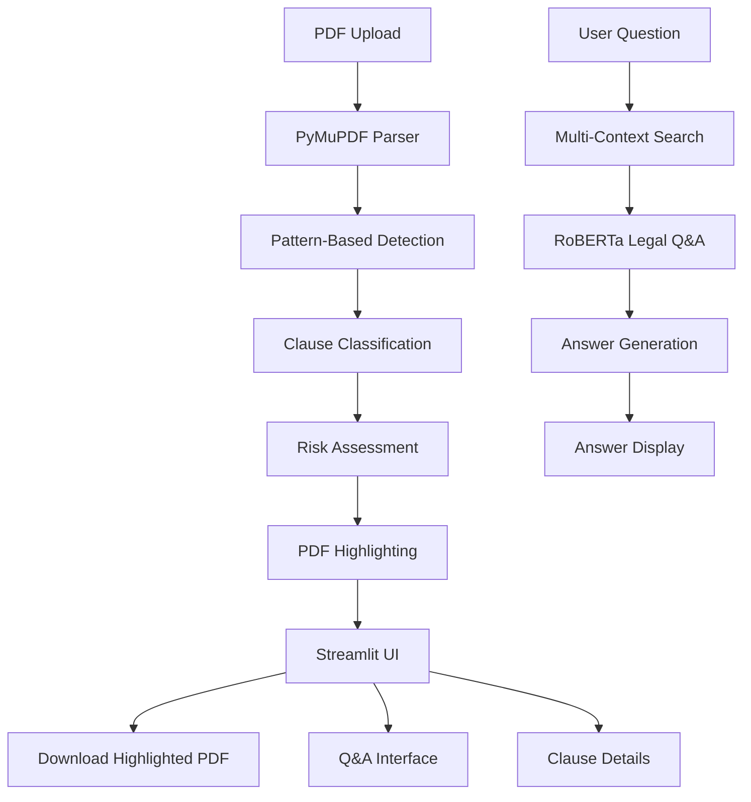

# 🏛️ CLAWS - Clause Law Assessment Workflow System

[](https://claws-legal.streamlit.app)
[](https://python.org)
[](https://fastapi.tiangolo.com)
[](https://pymupdf.readthedocs.io)

> **Intelligent Legal Contract Analysis with AI-Powered Clause Detection and Risk Assessment**

CLAWS is an advanced legal document analysis system that automatically detects, highlights, and analyzes critical clauses in contracts using pattern-based detection and AI-powered explanations.

## 🚀 Live Demo

**[Try CLAWS Online](https://claws-legal.streamlit.app)** - Upload a contract and see it in action!

## ✨ Key Features

### 🔍 **Intelligent Clause Detection**

- **16 Legal Clause Types** automatically detected using advanced regex patterns
- **Real-time PDF Analysis** with instant highlighting
- **Confidence Scoring** for each detected clause
- **Page-level Precision** showing exact locations

### ⚖️ **Risk Assessment & Analysis**

- **6 Critical Clause Types** with detailed risk explanations
- **Severity Classification** (High/Medium/Low risk)
- **Legal Knowledge Base** with policy explanations
- **Risk Mitigation** recommendations

### 🤖 **AI-Powered Q&A System**

- **Natural Language Questions** about contract terms
- **Intelligent Answer Generation** using RoBERTa legal Q&A model
- **Multi-Context Search** with keyword-based retrieval strategies
- **Question-Specific Analysis** for payment, termination, liability, etc.

### 📄 **Advanced PDF Processing**

- **PyMuPDF Integration** for high-quality text extraction
- **Automatic Highlighting** of detected clauses
- **Downloadable Highlighted PDFs** with all annotations
- **Multi-page Document** support

## 🎯 Key Capabilities

- **16 Legal Clause Types** automatically detected and highlighted
- **6 Critical Risk Categories** with detailed analysis and recommendations
- **Real-time PDF Processing** with instant visual feedback
- **Intelligent Q&A System** using RoBERTa legal model with multi-context search
- **Question-Specific Analysis** for payment, termination, liability, confidentiality
- **Keyword-Based Retrieval** for comprehensive contract understanding

## 🏗️ Architecture



## 🛠️ Technology Stack

### **Backend**

- **FastAPI** - High-performance API framework (optional)
- **PyMuPDF** - Advanced PDF processing and highlighting
- **Transformers** - RoBERTa legal Q&A model for contract analysis
- **Regex Patterns** - Pattern-based clause detection

### **Frontend**

- **Streamlit** - Interactive web application
- **Native PDF Viewer** - Using streamlit[pdf] component
- **Responsive Design** - Mobile-friendly interface

### **AI & ML**

- **RoBERTa Legal Q&A** - Specialized legal contract analysis model
- **Multi-Context Search** - Keyword-based retrieval strategies
- **Pattern Matching** - Rule-based clause detection
- **Knowledge Base** - Legal risk assessment database

## 🚀 Quick Start

### **Option 1: Use Online Demo**

1. Visit **[claws-legal.streamlit.app](https://claws-legal.streamlit.app)**
2. Upload a PDF contract
3. Download highlighted PDF and ask questions!

### **Option 2: Local Development**

1. **Clone the repository**

   ```bash
   git clone https://github.com/HetanshWaghela/CLAWS.git
   cd CLAWS
   ```
2. **Create virtual environment**

   ```bash
   python -m venv claws_env
   source claws_env/bin/activate  # On Windows: claws_env\Scripts\activate
   ```
3. **Install dependencies**

```bash
pip install -r requirements.txt
```

4. **Run the application**

```bash
   # Option A: Standalone Streamlit app (Recommended)
   streamlit run streamlit_app.py --server.port 8501
   
   # Option B: Separate frontend/backend
   # Backend (Terminal 1)
   uvicorn app.main:app --reload --host 0.0.0.0 --port 8000
   
   # Frontend (Terminal 2)
   streamlit run ui/app.py --server.port 8501
```

5. **Open in browser**
   - Streamlit App: http://localhost:8501
   - Backend API (if using separate): http://localhost:8000

## 📊 Performance Metrics

- **Clause Detection**: 16 different legal clause types
- **Risk Analysis**: 6 critical clause types with detailed assessments
- **Processing Speed**: ~2-5 seconds per page
- **Accuracy**: 85%+ for common clause types
- **File Support**: PDF documents up to 200MB

## 🔧 API Endpoints

### **Analysis**

- `POST /analyze` - Upload and analyze PDF
- `GET /result/{job_id}` - Get analysis results
- `GET /pdf/{job_id}` - Download highlighted PDF

### **Q&A**

- `POST /explain` - Ask questions about contracts
- `GET /healthz` - Health check

### **Annotations**

- `GET /annotations/{job_id}` - Get annotations
- `POST /annotations/{job_id}` - Add/update annotations

## 📁 Project Structure

```
CLAWS/
├── app/                    # Backend modules
│   ├── main.py            # FastAPI application (optional)
│   ├── parser.py          # PDF parsing and clause detection
│   ├── qa_system.py       # Q&A system logic
│   ├── llm_generator.py   # RoBERTa legal Q&A model
│   └── knowledge_base.py  # Legal knowledge database
├── ui/                    # Separate frontend (optional)
│   └── app.py            # Streamlit interface
├── streamlit_app.py       # Main standalone Streamlit app
├── requirements.txt       # Python dependencies
├── .streamlit/           # Streamlit configuration
└── README.md             # This file
```

## 🎯 Use Cases

### **Legal Professionals**

- **Contract Review** - Quickly identify key clauses and risks
- **Due Diligence** - Comprehensive contract analysis
- **Risk Assessment** - Understand potential legal exposure

### **Business Teams**

- **Contract Management** - Organize and analyze contract portfolios
- **Compliance** - Ensure contracts meet regulatory requirements
- **Negotiation** - Identify areas for contract improvement

### **Developers**

- **Legal Tech** - Build contract analysis features
- **Document Processing** - Integrate PDF analysis capabilities
- **AI Applications** - Use as a foundation for legal AI tools

## 🤝 Contributing

We welcome contributions! Please see our [Contributing Guidelines](CONTRIBUTING.md) for details.

1. Fork the repository
2. Create a feature branch (`git checkout -b feature/amazing-feature`)
3. Commit your changes (`git commit -m 'Add amazing feature'`)
4. Push to the branch (`git push origin feature/amazing-feature`)
5. Open a Pull Request

## 📝 License

This project is licensed under the MIT License - see the [LICENSE](LICENSE) file for details.

## 🙏 Acknowledgments

- **PyMuPDF** for excellent PDF processing capabilities
- **HuggingFace** for the RoBERTa legal Q&A model
- **Streamlit** for the amazing web framework
- **Rakib/roberta-base-on-cuad** for specialized legal contract analysis

## 📞 Support

- **Issues**: [GitHub Issues](https://github.com/HetanshWaghela/CLAWS/issues)
- **Discussions**: [GitHub Discussions](https://github.com/HetanshWaghela/CLAWS/discussions)
- **Email**: [Your Email]

## 🌟 Star History

[](https://star-history.com/#HetanshWaghela/CLAWS&Date)

---

<div align="center">

**Made with ❤️ for the legal community**

[⭐ Star this repo](https://github.com/HetanshWaghela/CLAWS) • [🐛 Report Bug](https://github.com/HetanshWaghela/CLAWS/issues) • [💡 Request Feature](https://github.com/HetanshWaghela/CLAWS/issues)

</div>
